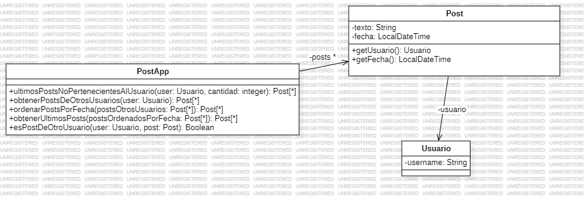

### 2.3 Publicaciones

1. indique el mal olor,
2. indique el refactoring que lo corrige, 
3. aplique el refactoring, mostrando el resultado final (código y/o diseño según corresponda). 

Si vuelve a encontrar un mal olor, retorne al paso (1). 


```java
/**
* Retorna los últimos N posts que no pertenecen al usuario user
*/
public List<Post> ultimosPosts(Usuario user, int cantidad) {
    List<Post> postsOtrosUsuarios = new ArrayList<Post>();
    for (Post post : this.posts) {
        if (!post.getUsuario().equals(user)) {
            postsOtrosUsuarios.add(post);
        }
    }
    // ordena los posts por fecha
    for (int i = 0; i < postsOtrosUsuarios.size(); i++) {
        int masNuevo = i;
        for(int j= i +1; j < postsOtrosUsuarios.size(); j++) {
            if (postsOtrosUsuarios.get(j).getFecha().isAfter( postsOtrosUsuarios.get(masNuevo).getFecha())) {
                masNuevo = j;
            }
        }
        Post unPost = postsOtrosUsuarios.set(i,postsOtrosUsuarios.get(masNuevo));
        postsOtrosUsuarios.set(masNuevo, unPost);
    }
    List<Post> ultimosPosts = new ArrayList<Post>();
    int index = 0;
    Iterator<Post> postIterator = postsOtrosUsuarios.iterator();
    while (postIterator.hasNext() && index < cantidad) {
        ultimosPosts.add(postIterator.next());
    }
    return ultimosPosts;
}
```

1. **Mal Olor**: Método muy largo y poco descriptivo

2. **Refactoring**: "Extract Method" para hacer un nuevo método con las 3 funcionalidades que tiene y renombrar el método ultimosPosts()

3. **Resultado:**


```java
/**
* Retorna los últimos N posts que no pertenecen al usuario user
*/
public List<Post> ultimosPostsNoPertenecientesAlUsuario(Usuario user, int cantidad) {
    
    /*List<Post> postsOtrosUsuarios = new ArrayList<Post>();
    for (Post post : this.posts) {
        if (!post.getUsuario().equals(user)) {
            postsOtrosUsuarios.add(post);
        }
    }*/ //Reemplazado por:
    
    List<Post> postsOtrosUsuarios = this.obtenerPostsDeOtrosUsuario(user);

    /*// ordena los posts por fecha
    for (int i = 0; i < postsOtrosUsuarios.size(); i++) {
        int masNuevo = i;
        for(int j= i +1; j < postsOtrosUsuarios.size(); j++) {
            if (postsOtrosUsuarios.get(j).getFecha().isAfter( postsOtrosUsuarios.get(masNuevo).getFecha())) {
                masNuevo = j;
            }
        }
        Post unPost = postsOtrosUsuarios.set(i,postsOtrosUsuarios.get(masNuevo));
        postsOtrosUsuarios.set(masNuevo, unPost);
    }*/  //Reemplazado por:
    List<Post> postsOrdenadosPorFecha = this.ordenarPostsPorFecha(postsOtrosUsuarios);
    
    /*
    List<Post> ultimosPosts = new ArrayList<Post>();
    int index = 0;
    Iterator<Post> postIterator = postsOtrosUsuarios.iterator();
    while (postIterator.hasNext() && index < cantidad) {
        ultimosPosts.add(postIterator.next());
    }*/ //Reemplazado por:
    List<Post> ultimosPosts = this.obtenerUltimosPosts(postsOrdenadosPorFecha,cantidad);

    return ultimosPosts;
}

public List<Post> obtenerPostsDeOtrosUsuario(Usuario user){
    List<Post> postsOtrosUsuarios = new ArrayList<Post>()
    for (Post post : this.posts) {
        if (!post.getUsuario().equals(user)) {
            postsOtrosUsuarios.add(post);
        }
    }
    return postsOtrosUsuarios;
}

public List<Post> ordenarPostsPorFecha(List<Post> postsOtrosUsuarios){
    //ordena los posts por fecha
    for (int i = 0; i < postsOtrosUsuarios.size(); i++) {
        int masNuevo = i;
        for(int j= i +1; j < postsOtrosUsuarios.size(); j++) {
            if (postsOtrosUsuarios.get(j).getFecha().isAfter( postsOtrosUsuarios.get(masNuevo).getFecha())) {
                masNuevo = j;
            }
        }
        Post unPost = postsOtrosUsuarios.set(i,postsOtrosUsuarios.get(masNuevo));
        postsOtrosUsuarios.set(masNuevo, unPost);
    }
    return postOtrosUsuarios;
}

public List<Post> obtenerUltimosPosts(List<Post> postsOrdenadosPorFecha, int cantidad){
    List<Post> ultimosPosts = new ArrayList<Post>();
    int index = 0;
    Iterator<Post> postIterator = postsOrdenadosPorFecha.iterator();
    while (postIterator.hasNext() && index < cantidad) {
        ultimosPosts.add(postIterator.next());
    }
    return ultimosPosts;
}

```

1. **Mal Olor**: Reinventar la rueda -> La utilización de for e if cuando ya existe la API de Stream que me maneja de manera eficiente y ordenada los metodos "obtenerPostsDeOtrosUsuario", "ordenarPostsPorFecha()" y "obtenerUltimosPosts()"

2. **Refactoring**: Replace Loop with Pipeline

    1. Identificar el bucle existente: Localiza el bucle en tu código que realiza la iteración sobre una colección de elementos.
    2. Crear un Stream: Crea un Stream a partir de la colección de elementos utilizando el método stream() o parallelStream().
    3. Encadenar operaciones: Encadena las operaciones funcionales (filter, map, reduce, etc.) en el Stream. Estas operaciones representarán las transformaciones y filtrados que se aplicarán a los elementos del Stream.
    4. Reemplazar las operaciones del bucle: Examina el cuerpo del bucle y reemplaza las operaciones que se realizan en cada iteración con las correspondientes operaciones funcionales en el Stream.
    5. Ejecutar la tubería (pipeline): Utiliza un método terminal, como forEach, collect, reduce u otros, para ejecutar la tubería (pipeline) y obtener el resultado deseado.
    6. Validar y probar: Asegúrate de que el resultado de la tubería de operaciones sea equivalente al resultado original del bucle. Realiza pruebas exhaustivas para confirmar que el comportamiento sea el esperado.

3. **Resultado**: 


```java
/**
* Retorna los últimos N posts que no pertenecen al usuario user
*/
public List<Post> ultimosPostsNoPertenecientesAlUsuario(Usuario user, int cantidad) {
    
    List<Post> postsOtrosUsuarios = this.obtenerPostsDeOtrosUsuario(user);

    List<Post> postsOrdenadosPorFecha = this.ordenarPostsPorFecha(postsOtrosUsuarios);

    List<Post> ultimosPosts = this.obtenerUltimosPosts(postsOrdenadosPorFecha,cantidad);

    return ultimosPosts;
}

public List<Post> obtenerPostsDeOtrosUsuario(Usuario user){
    return this.posts.stream()
                        .filter(p -> !p.getUsuario().equals(user))
                        .collect(Collectors.toList());
}

public List<Post> ordenarPostsPorFecha(List<Post> postsOtrosUsuarios){
    return postsOtrosUsuarios.stream()
                                .sorted((p1,p2) -> p1.getFecha().compareTo(p2.getFecha()))
                                .collect(Collectors.toList());
}

public List<Post> obtenerUltimosPosts(List<Post> postsOrdenadosPorFecha, int cantidad){
    return postOrdenadosPorFecha.stream()
                                    .limit(cantidad)
                                    .collect(Collectors.toList());
}

```

1. **Mal Olor:** Responsabilidad mal asignada. El método "ultimosPostsNoPertenecientesAlUsuario()" verifica de que el usuario no sea el dueño del post, cuando en realidad debería ser responsabilidad de la clase "Post". (Feature Envy y Data Class)

2. **Refactoring:** Extract Method y Move Method

3. **Resultado:**



```java
public List<Post> ultimosPostsNoPertenecientesAlUsuario(Usuario user, int cantidad) {
    
    List<Post> postsOtrosUsuarios = this.obtenerPostsDeOtrosUsuario(user);

    List<Post> postsOrdenadosPorFecha = this.ordenarPostsPorFecha(postsOtrosUsuarios);

    List<Post> ultimosPosts = this.obtenerUltimosPosts(postsOrdenadosPorFecha,cantidad);

    return ultimosPosts;
}

public List<Post> obtenerPostsDeOtrosUsuario(Usuario user){
    return this.posts.stream()
                        .filter(p -> esPostDeOtroUsuario(user,p))
                        .collect(Collectors.toList());
}
//Extract Method:
public boolean esPostDeOtroUsuario(usuario user, Post post){
    return !post.getUsuario().equals(user)
}

public List<Post> ordenarPostsPorFecha(List<Post> postsOtrosUsuarios){
    return postsOtrosUsuarios.stream()
                                .sorted((p1,p2) -> p1.getFecha().compareTo(p2.getFecha()))
                                .collect(Collectors.toList());
}

public List<Post> obtenerUltimosPosts(List<Post> postsOrdenadosPorFecha, int cantidad){
    return postOrdenadosPorFecha.stream()
                                    .limit(cantidad)
                                    .collect(Collectors.toList());
}

```

```java
public List<Post> ultimosPostsNoPertenecientesAlUsuario(Usuario user, int cantidad) {
    
    List<Post> postsOtrosUsuarios = this.obtenerPostsDeOtrosUsuario(user);

    List<Post> postsOrdenadosPorFecha = this.ordenarPostsPorFecha(postsOtrosUsuarios);

    List<Post> ultimosPosts = this.obtenerUltimosPosts(postsOrdenadosPorFecha,cantidad);

    return ultimosPosts;
}

public List<Post> obtenerPostsDeOtrosUsuario(Usuario user){
    return this.posts.stream()
                        .filter(p -> p.esPostDeOtroUsuario(user))
                        .collect(Collectors.toList());
}

public List<Post> ordenarPostsPorFecha(List<Post> postsOtrosUsuarios){
    return postsOtrosUsuarios.stream()
                                .sorted((p1,p2) -> p1.getFecha().compareTo(p2.getFecha()))
                                .collect(Collectors.toList());
}

public List<Post> obtenerUltimosPosts(List<Post> postsOrdenadosPorFecha, int cantidad){
    return postOrdenadosPorFecha.stream()
                                    .limit(cantidad)
                                    .collect(Collectors.toList());
}

//En clase Post:
//Move Method:
public boolean esPostDeOtroUsuario(usuario user){
    return !this.getUsuario().equals(user)
}
```
