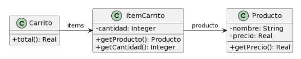
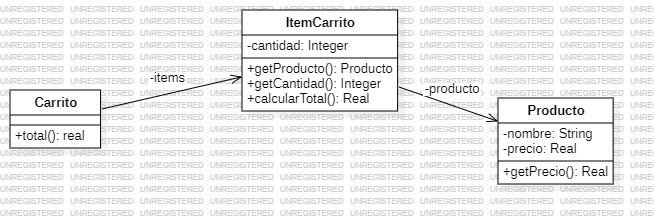

### 2.4 Carrito de Compras

1. indique el mal olor,
2. indique el refactoring que lo corrige, 
3. aplique el refactoring, mostrando el resultado final (código y/o diseño según corresponda). 

Si vuelve a encontrar un mal olor, retorne al paso (1). 



```java
public class Producto {
    private String nombre;
    private double precio;

    public double getPrecio() {
        return this.precio;
    }
} 
public class ItemCarrito {
    private Producto producto;
    private int cantidad;

    public Producto getProducto() {
        return this.producto;
    } 

    public int getCantidad() {
        return this.cantidad;
    }
} 
public class Carrito {
    private List<ItemCarrito> items;

    public double total() {
        return this.items.stream()
                            .mapToDouble(item -> item.getProducto().getPrecio() * item.getCantidad())
                            .sum();
    }
}
```

1. **Mal Olor:** Responsabilidad mal asignada, la clase Carrito no tiene que sacar el total de cada Item, corresponde a la clase ItemCarrito, --> Feature Envy y Data Class 

2. **Refactoring:** Extract Method y Move Method

3. **Resultado:**
"Extract Method:"

```java
public class Producto {
    private String nombre;
    private double precio;

    public double getPrecio() {
        return this.precio;
    }
} 
public class ItemCarrito {
    private Producto producto;
    private int cantidad;

    public Producto getProducto() {
        return this.producto;
    } 

    public int getCantidad() {
        return this.cantidad;
    }
} 
public class Carrito {
    private List<ItemCarrito> items;

    public double total() {
        return this.items.stream()
                            .maptoDouble(item -> cantidadTotalItem(item))
                            .sum();
    }

    public double cantidadTotalItem(ItemCarrito item){
        return item.getProducto().getPrecio() * item.getCantidad()
    }
}
```
"Move Method:"

```java
public class Producto {
    private String nombre;
    private double precio;

    public double getPrecio() {
        return this.precio;
    }
} 

public class ItemCarrito {
    private Producto producto;
    private int cantidad;

    public Producto getProducto() {
        return this.producto;
    } 

    public int getCantidad() {
        return this.cantidad;
    }

    public double calcularTotal(){
        return item.getProducto().getPrecio() * item.getCantidad()
    }
} 

public class Carrito {
    private List<ItemCarrito> items;

    public double total() {
        return this.items.stream()
                            .maptoDouble(item -> item.calcularTotal())
                            .sum();
    }
}
```


