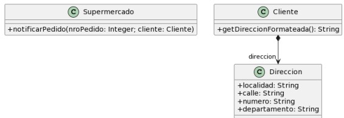

### 2.5 Envío de Pedidos

1. indique el mal olor,
2. indique el refactoring que lo corrige, 
3. aplique el refactoring, mostrando el resultado final (código y/o diseño según corresponda). 

Si vuelve a encontrar un mal olor, retorne al paso (1). 



```java
public class Supermercado {
    public void notificarPedido(long nroPedido, Cliente cliente) {
        String notificacion = MessageFormat.format(“Estimado cliente, se le informa que hemos recibido su pedido con número {0}, el cual ser enviado a la dirección {1}”, new Object[] { nroPedido, cliente.getDireccionFormateada() });
        // lo imprimimos en pantalla, podría ser un mail, SMS, etc..
        System.out.println(notificacion);
    }
} 
public class Cliente {
    public String getDireccionFormateada() {
        return
            this.direccion.getLocalidad() + ", " +
            this.direccion.getCalle() + ", " +
            this.direccion.getNumero() + ", " +
            this.direccion.getDepartamento();
    }   
}
```

1. **Mal Olor:** - Atributos de la clase Dirección públicos, rompe encapsulamiento

2. **Refactoring:** - Encapsulate Field(Pone los atributos en private, crea getters y setters  y los invoca donde corresponda)

3. **Resultado:** 
```java
public class Supermercado {
    public void notificarPedido(long nroPedido, Cliente cliente) {
        String notificacion = MessageFormat.format(“Estimado cliente, se le informa que hemos recibido su pedido con número {0}, el cual ser enviado a la dirección {1}”, new Object[] { nroPedido, cliente.getDireccionFormateada() });
        // lo imprimimos en pantalla, podría ser un mail, SMS, etc..
        System.out.println(notificacion);
    }
} 
public class Cliente {
    private Direccion direccion;

    public String getDireccionFormateada() {
        return
            this.direccion.getLocalidad() + ", " +
            this.direccion.getCalle() + ", " +
            this.direccion.getNumero() + ", " +
            this.direccion.getDepartamento();
    }   
}
public class Direccion {
    private String localidad;
    private String calle;
    private String numero;
    private String departamento;
}
```
1. **Mal Olor:** - Falta de constructor para inicializar la dirección como corresponde

2. **Refactoring:** - 

3. **Resultado:** 
```java
public class Supermercado {
    public void notificarPedido(long nroPedido, Cliente cliente) {
        String notificacion = MessageFormat.format(“Estimado cliente, se le informa que hemos recibido su pedido con número {0}, el cual ser enviado a la dirección {1}”, new Object[] { nroPedido, cliente.getDireccionFormateada() });
        // lo imprimimos en pantalla, podría ser un mail, SMS, etc..
        System.out.println(notificacion);
    }
} 
public class Cliente {
    private Direccion direccion;
    
    public String getDireccionFormateada() {
        return
            this.direccion.getLocalidad() + ", " +
            this.direccion.getCalle() + ", " +
            this.direccion.getNumero() + ", " +
            this.direccion.getDepartamento();
    }   
}
public class Direccion {
    private String localidad;
    private String calle;
    private String numero;
    private String departamento;

    public Direccion(String l, String c,String n, String d){
        this.localidad = l;
        this.calle = c;
        this.numero = n;
        this.departamento = d;
    }
}
```

1. **Mal Olor:** - Envidia de atributos y mala asignación de responsabilidad, la dirección formateada debe provenir de la clase Dirección, no de la clase cliente

2. **Refactoring:** - Extract Method y Move Method **(se puede mostrar en dos pasos, lo dejo así o en dos pasos?)**

3. **Resultado:** 
```java
public class Supermercado {
    public void notificarPedido(long nroPedido, Cliente cliente) {
        String notificacion = MessageFormat.format(“Estimado cliente, se le informa que hemos recibido su pedido con número {0}, el cual ser enviado a la dirección {1}”, new Object[] { nroPedido, cliente.getDireccionFormateada() });
        // lo imprimimos en pantalla, podría ser un mail, SMS, etc..
        System.out.println(notificacion);
    }
} 
public class Cliente {
    private Direccion direccion;
    
    public String getDireccionFormateada() {
        return this.direccion.getDireccionFormateada();
    }   
}
public class Direccion {
    private String localidad;
    private String calle;
    private String numero;
    private String departamento;

    public Direccion(String l, String c,String n, String d){
        this.localidad = l;
        this.calle = c;
        this.numero = n;
        this.departamento = d;
    }

    public String getDireccionFormateada() {
        return 
            this.localidad() + ", " +
            this.calle() + ", " +
            this.numero() + ", " +
            this.departamento();
    }  
}
```